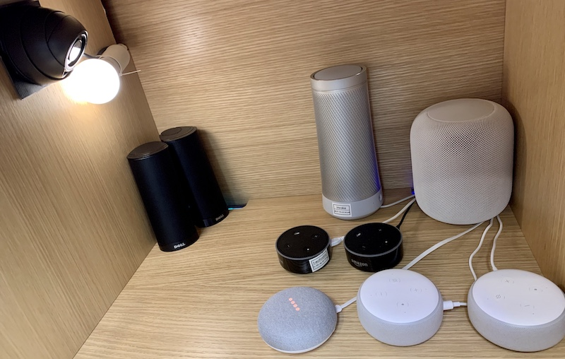

# When Speakers Are All Ears: Characterizing Misactivations of IoT Smart Speakers

This site contains data and code that accompany the paper "When Speakers Are All Ears: Characterizing Misactivations of IoT Smart Speakers", 
in proceedings of the 20th Privacy Enhancing Technologies Symposium (PETS 2020), July 14-18, 2020, Virtual.

The official paper page can be found at https://moniotrlab.ccis.neu.edu/smart-speakers-study/.

## File Structure 

- `README.md`   # This file
- `LICENSE.md`   # License
- `data/`    # Source material and data we produced during the experiments and analysis  
- `scripts/`   # Scripts for running experiments and for analyzing the data   

## Virtual Machine
A preconfigured Ubuntu 20.04 Virtual Machine containing all our script (except for the testbed and the MATLAB code) can be downloaded at
https://www.dropbox.com/sh/rcm5y7o0e14mrjm/AACrxNEPcd7jkhpsYkxvSn0da?dl=0

## Additional information
Each subdirectory has its own README file with additional details.
